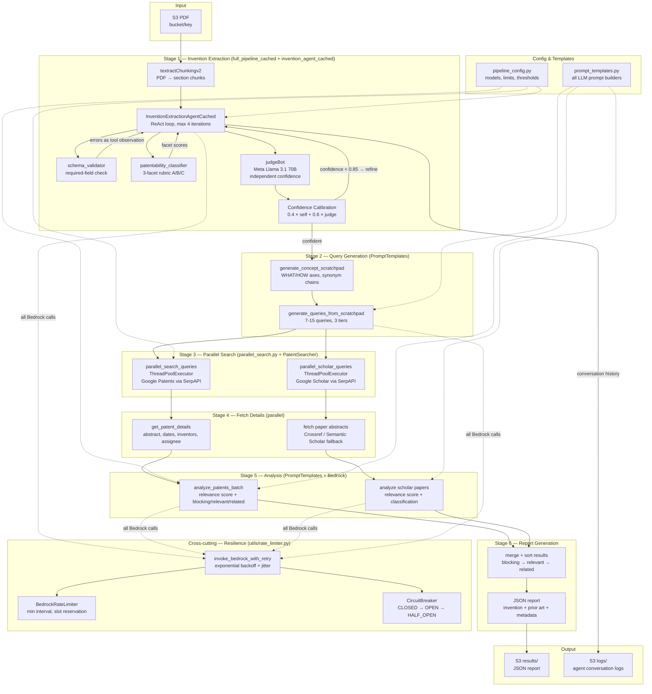
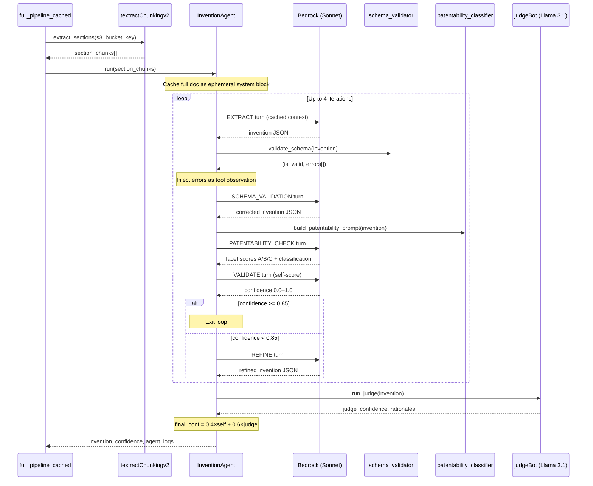
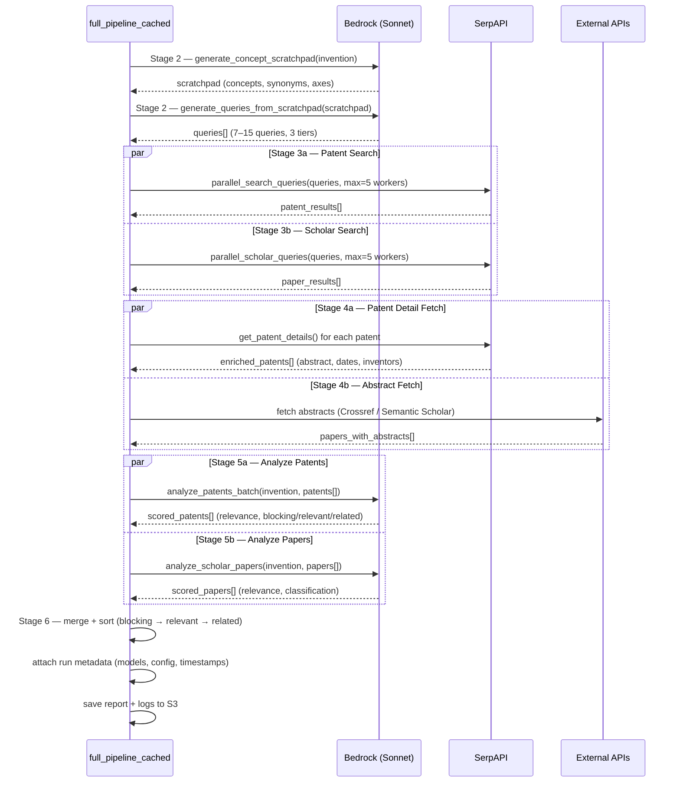

# Patent Agent — Architecture Review

## Overview

The patent agent is an end-to-end pipeline that ingests a PDF from S3, extracts a structured invention description using a ReAct-based LLM agent, searches for prior art (patents + academic papers), analyzes each result for relevance, and produces a final JSON report saved back to S3.

The system is designed around three cross-cutting concerns:
- **Correctness** — multi-turn self-correction with schema validation and independent judge scoring
- **Resilience** — rate limiting, circuit breaking, and exponential backoff on all Bedrock calls
- **Cost efficiency** — prompt caching (ephemeral cache blocks) to reuse the full document context across agent iterations

---

## Pipeline Stages

| Stage | Description | Model |
|-------|-------------|-------|
| 1 | Invention extraction (ReAct agent, up to 4 iterations) | Claude Sonnet (cached) |
| 2 | Search query generation (2-step scratchpad → queries) | Claude Sonnet |
| 3 | Patent + Scholar search (parallel SerpAPI calls) | — |
| 4 | Fetch patent details + paper abstracts (parallel) | — |
| 5 | Analyze patents + papers vs. invention | Claude Sonnet |
| 6 | Aggregate and generate final report | — |

---

## Component Diagram

---

## Sequence Diagram — Invention Extraction (Stage 1)

---

## Sequence Diagram — Search & Analysis (Stages 2–6)

---

## Key Architectural Patterns

### 1. ReAct Loop with Prompt Caching
The invention agent maintains a multi-turn conversation where the full PDF is cached once as an ephemeral system block. Each iteration (extract → validate → patentability check → refine) reuses this cache, cutting token costs significantly across up to 4 loops.

### 2. Tool Observations as Conversation Turns
Schema validation errors and patentability classifier output are injected back into the multi-turn conversation as "tool observation" user turns. This lets the LLM see and self-correct its own failures without breaking the cached context.

### 3. Dual-Confidence Calibration
Self-reported confidence (from the agent's own VALIDATE turn) is blended with an independent judge score from Meta Llama 3.1 70B (run via Bedrock on a separate model). The weighted blend `0.4 × self + 0.6 × judge` prevents the agent from over-trusting its own output.

### 4. Parallel Fan-Out
Stages 3, 4, and 5 all use `ThreadPoolExecutor` to run patent and scholar pipelines concurrently, with configurable `max_concurrent` worker limits.

### 5. Layered Resilience
All Bedrock calls route through `invoke_bedrock_with_retry()`, which enforces:
- Minimum call interval (BedrockRateLimiter, slot reservation)
- Circuit breaker state machine (CLOSED → OPEN → HALF_OPEN)
- Exponential backoff with jitter on retryable errors

### 6. Config-Driven Thresholds
All limits (max iterations, confidence threshold, max patents to analyze, worker counts, model IDs) live in `pipeline_config.py`, keeping business logic separate from tunable parameters.

---

## Known Limitations

| Issue | Location | Status |
|-------|----------|--------|
| SerpAPI `before: 20220101` hardcoded date cutoff | `PatentSearcher.search()` | Unfixed — missing 3+ years of prior art |
| Greedy JSON regex `[\[{].*[\]}]` can overcapture | `full_pipeline_cached.py`, `invention_agent_cached.py` | Unfixed |
| Max 2 pipeline restart attempts on `JsonParseExhaustedError` | `full_pipeline_cached.py` | By design |
